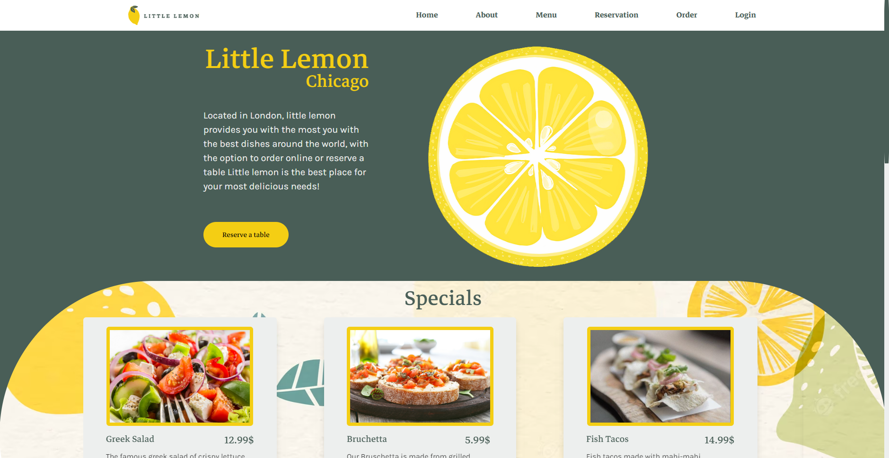
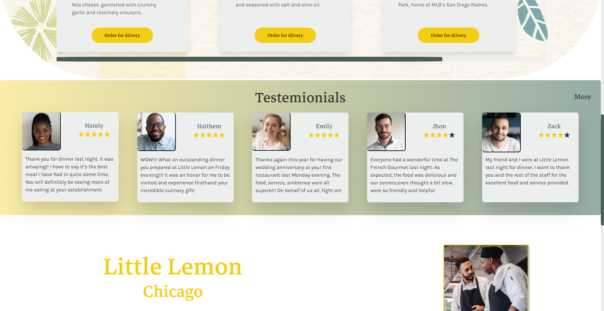
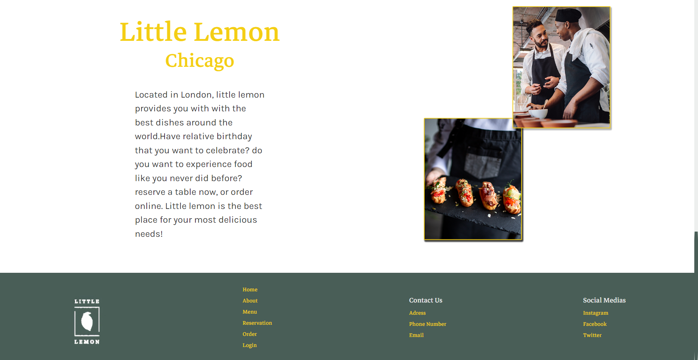
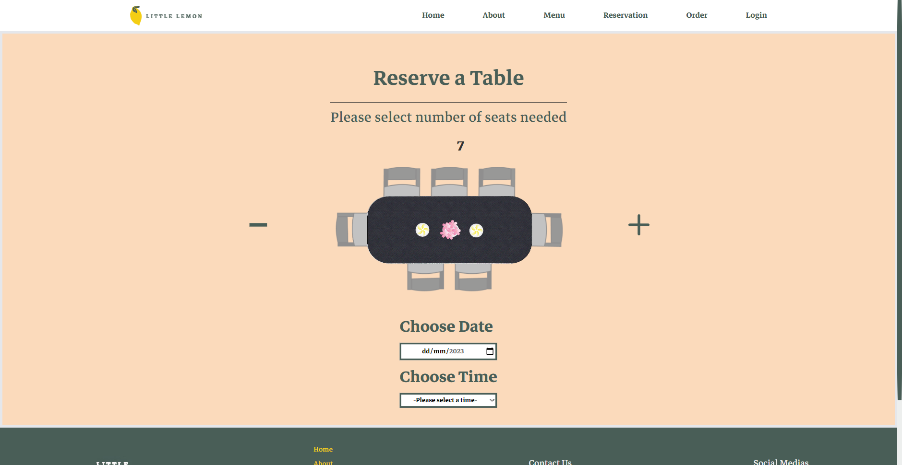
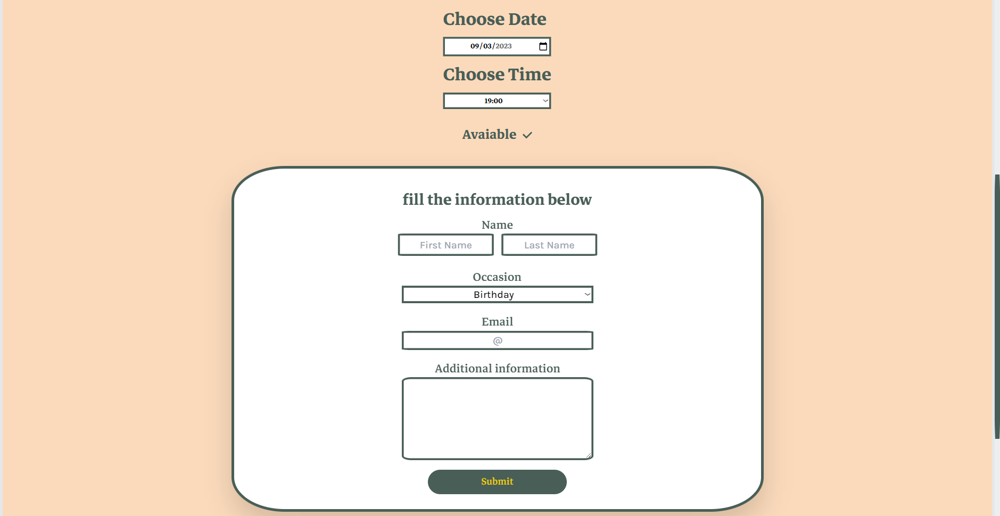

# Little Lemon website

This is a concept website for a resturant named Little Lemon, which included the home page of the site + the reserving a table page

## Table of contents

- [Overview](#overview)
  - [The challenge](#the-challenge)
  - [Screenshot](#screenshot)
  - [Links](#links)
- [My process](#my-process)
  - [Built with](#built-with)
  - [What I learned](#what-i-learned)
  - [Continued development](#continued-development)
  - [Useful resources](#useful-resources)
- [Author](#author)
- [Acknowledgments](#acknowledgments)

## Overview

### The challenge

- Build out the project to the designs provided
- Making sure it's fully responsive and works for all screen widths
- Making sure the reserve a table page and forms inside it comply to Ux/Ui design prenciples

### Screenshot

### Links

- Live Site URL: (https://ladel46.github.io/Little-Lemon-Concept-Website)

## My process

### Built with

- Semantic HTML5 markup
- CSS custom properties
- Tailwind CSS
- Flexbox
- CSS Grid
- Mobile-first workflow
- [React](https://reactjs.org/) - JS library
- [TailwindCss](https://tailwindcss.com/) - CSS framework
- [Form library](https://formik.org/) - For forms
- [Yup library](https://www.npmjs.com/package/yup/) - For form validation
- [Framer Motion library](https://www.framer.com/motion/) - For element animations
- [Figma](https://www.figma.com/) - For designing mockups

### What I learned

By doing this project, i improved my skills in create designs of websites using provided requirements and style guides, and then translating those deisngs that were made by figma into working React application that elevates the experience while taking Ui/Ux deisng prenciples into consideration. It was my first experience with Tailwind css which was pleasent, it made styling elements much faster and more convinent. Also, a peace of my website i would love to highlight is the responsive table that shows when a user selects the number of seats needed, which dynamicly changes depending on user input, and form element that mounts if the table entered is avaible at the time and date selected or not. Lastely, animations where created with Framer Motion which made the process straight forward and simple.

### Continued development

In the future works, im aiming to improve my animation skills to make my websites more lively and fun, and also aiming to improve my code clarity.

### Useful resources

- [TailWindCss documentation](https://tailwindcss.com/docs/installation) - This made using TailWindCss very easy and straight forward, as long as you have the CSS knowledge trainsitioning to TailWind is simple.
- [Framer Motion documentation](https://www.framer.com/motion/) - Framer motion made making animations much simpler and their documntation are perfect for any type of idea you have in mind.
- [W3Schools Css Refrence](https://www.w3schools.com/cssref/index.php) - Its has any questions you might have of Css answered with live examples, very good for any type of Css research.

## Author

- LinkedIn - [Adel Hafri](https://www.linkedin.com/in/adel-hafri/)
